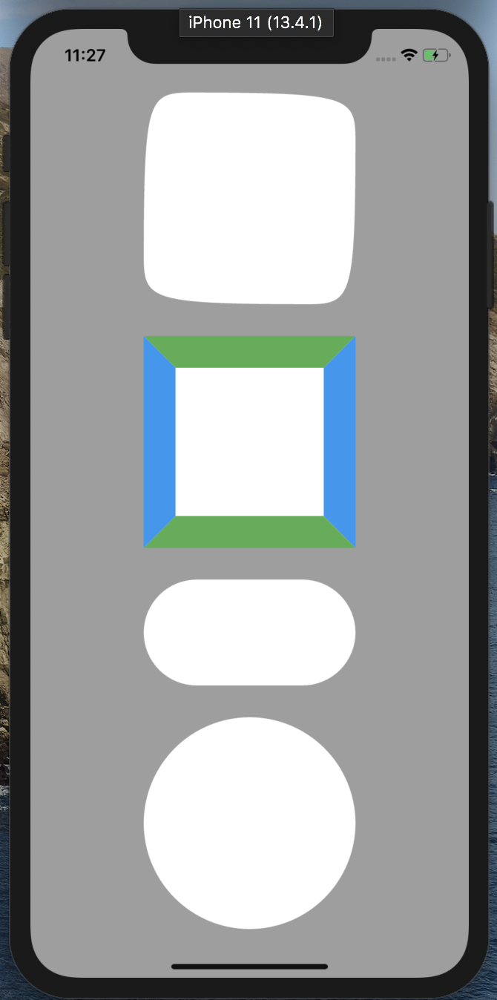
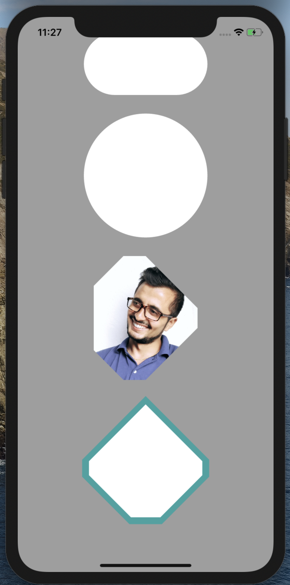
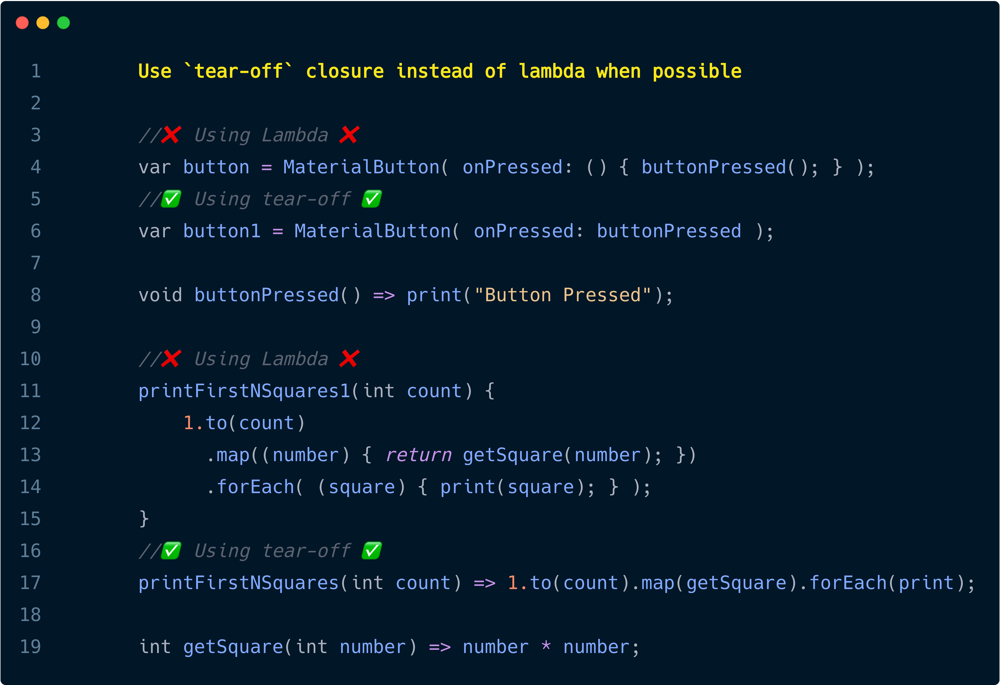
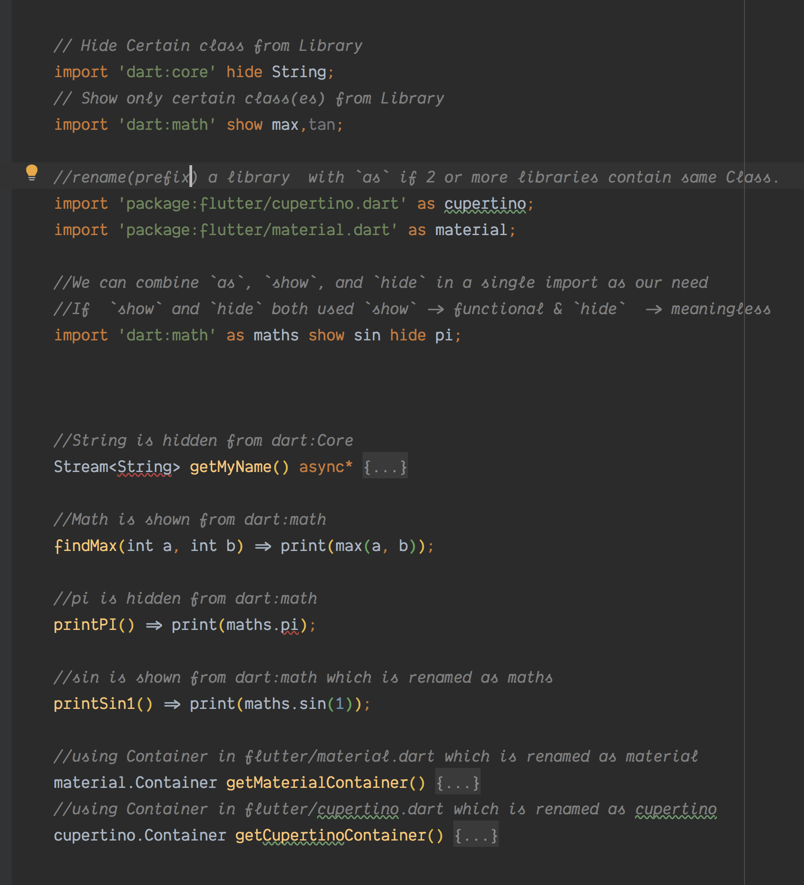
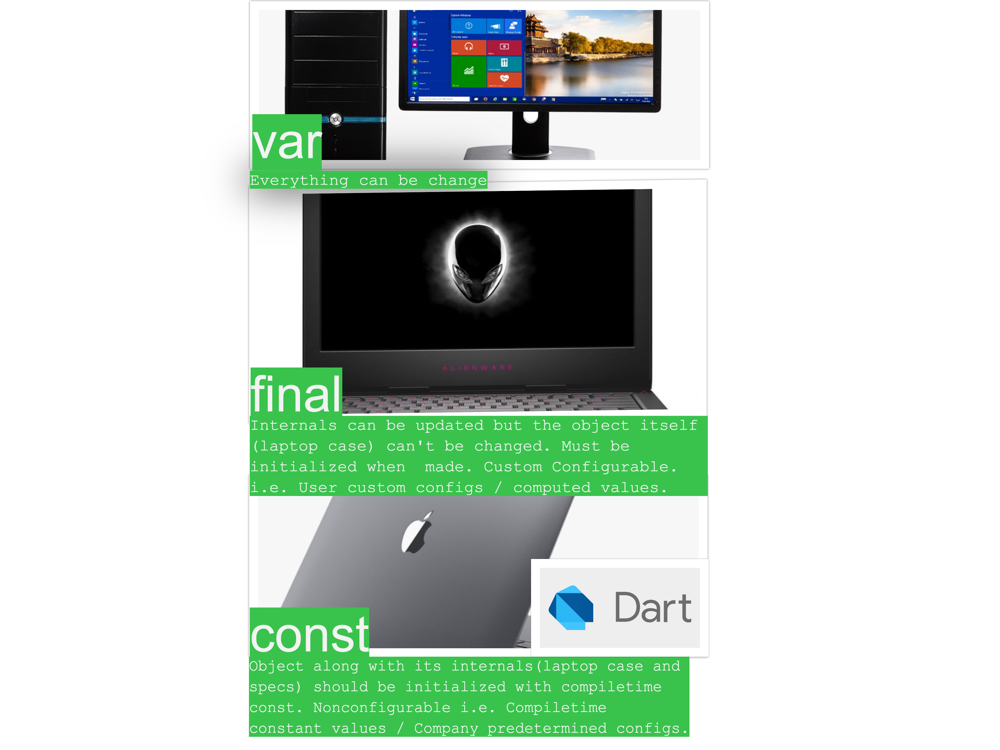
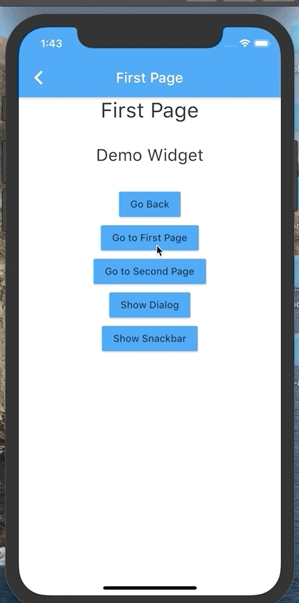
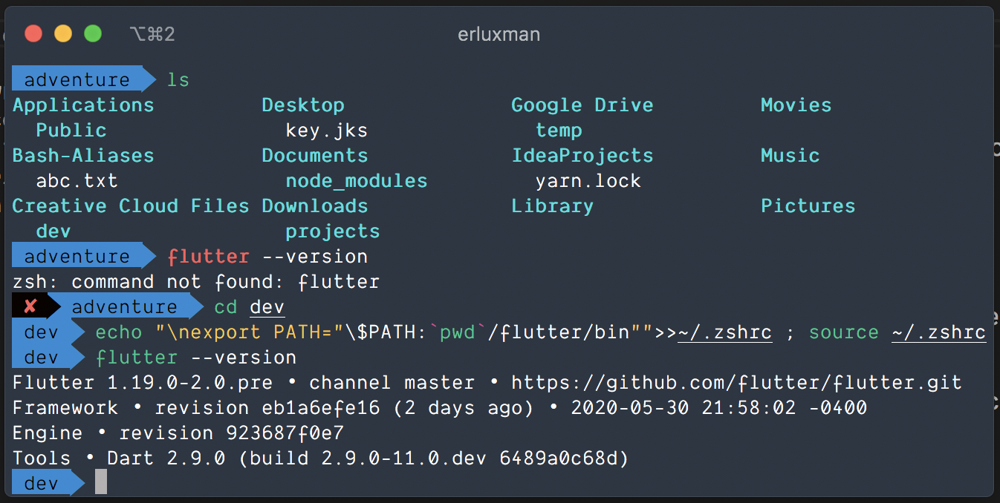
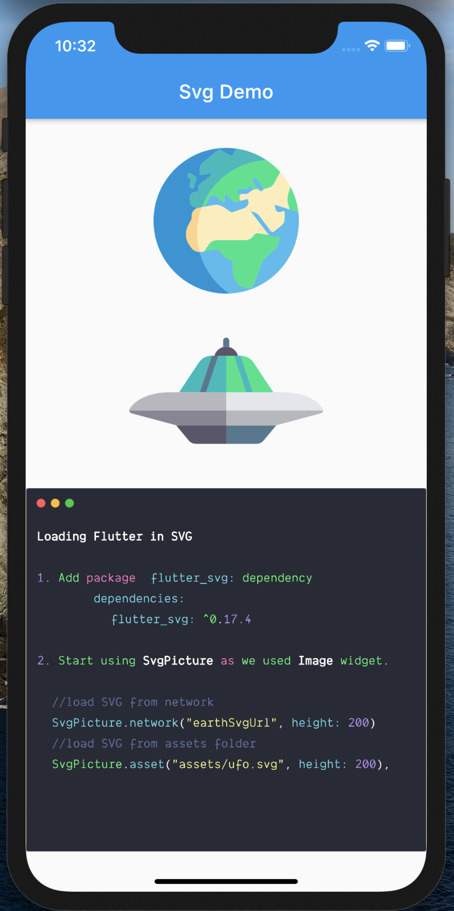
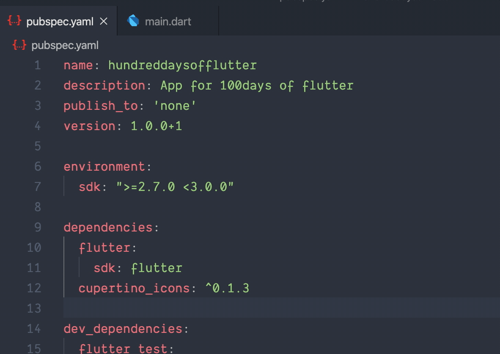

# ❤️Awesome Flutter ❤️ tips and tricks ❤️

## #Day1 `stless` & `stful`.

We can type `stless` and `stful` and we get Autocomplete Suggestion to generate Stateless Flutter Widget or Stateful Flutter Widget Respectively.

## #Day2 `If Null` Operator (`??`).

`??` checks If something is `null`. If it's not null it returns its own value but if it's `null` it returns the value after `??`

`return abc??10; //returns 10 if abc is null else returns its own value,`

It also has shorthand assignment when it's null.

`abc??=5 //assigns 5 to abc if it's null`

## #Day3 Inner Function.

We can define a function inside another function.

This is to encapsulate the inner function from everything else outside the outer function.

## #Day4 ..Cascade..Chaining..Fluent API

We can chain method/member calls without returning `this` from **method(), getter() and setter()** using cascade operator (..)

try in [Dartpad](https://dartpad.dartlang.org/290e17306b745ed83b9242653ca55041)

Can be replaced with

## #Day5 Dart `data class`

Dart does not support data class by default, but with plugins, we can simply generate data class (`copyWith()`,`fromMap()`, `toMap()`, `Named Constructor`, `toString()`,`hashCode()` & `equals()` methods implemented by the tool).

### `🚨❗️Caution❗️🚨` : **Your cursor should be inside the class that you want to generate data class.**

Download Plugins :

[For Android Studio](https://plugins.jetbrains.com/plugin/12429-dart-data-class)

[For VsCode](https://marketplace.visualstudio.com/items?itemName=BendixMa.dart-data-class-generator)

## #Day6 RichText Widget

If you want to have a single text with different style within it? Do not bother or try to hack with with `Text()` and use `RichText()` with `TextSpan()`

[Try on dartpad](https://dartpad.dartlang.org/f87dddb2f48f1d1ef0f25903af1ded58)

[See Youtube Demo](https://www.youtube.com/watch?v=rykDVh-QFfw)

## #Day7 Spacer Widget

Using Container with certain height/width to create responsive space between Widgets? That may look good on one screen but will not look the same in different screen size.

Spacer Widget comes for the rescue. Instead of `Container(width: / height: )`, use `Spacer(flex: )`.

How on this earth did I not know about this widget earlier? This is going to save many lives 😂

[Try on dartpad](https://dartpad.dev/f0d077124527a8078cdb2eede1e9bf73)

[See Youtube Demo](https://www.youtube.com/watch?v=7FJgd7QN1zI)

## #Day8

If you have you been adding `Container()` with `maxwidth` at the bottom of `ListItem` to put divider line like me, you have been doing it wrong all the time.

Flutter has `ListView.separated` just for that purpose. We have to also provide `separatorBuilder` in addition to what we already passed while using `ListView.builder`

**Bonus 🍾🎁🎊🎉 : You do not have to check if the item is last in order not to draw divider after the last item.**

[try in dartpad](https://dartpad.dartlang.org/31ec967b140ac6a5795c38ea4bdfd9a2)

## #Day9 Passing Function as parameter

We can simply pass a `function` as `parameter` like we pass a variable. When we want to call the passed function from calling function, we just call it with `()` at the end along with parameters if it accepts any.

[try in dartpad](https://dartpad.dev/fa46336f5c1b3287c6420d3b3a277178)

---

## #Day10 Relative Import : the right way to import `.dart` files we have in our lib package.

Ever wondered what is the right way to import a file in your own package?

Prefer relative imports to absolute imports.

Why?

- It's shorter and cleaner.
- We can easily differentiate our files and third-party ones.
- It makes sense, doesn't it?

## #Day11 Reusing Text Style

Tired of defining `textStyle` everytime you want to customize `Text`? **Even worse** if you have multiple theme (**dark, light, full black theme etc**).

just use

`Theme.of(context).textTheme.title`

where there are other styles like `title` inside `textTheme`.

[try in dartpad with theme example](https://dartpad.dartlang.org/5270714ce97853fc36db1b17c255c999)

## #Day12 Use Literal to initialize growable collections.

If we are to initialize growable collection, use literal initialization rather than with constructors.

    // Good
    var points = [];
    var addresses = {};

    // Bad
    var points = List();
    var addresses = Map();

    // With type argument

    // Good
    var points = <Point>[];
    var addresses = <String, Address>{};

    // Bad
    var points = List<Point>();
    var addresses = Map<String, Address>();

## #Day13 Fat arrow functions

We can use fat arrow `=>` members (`function, getter,setter`) in dart.

I would not use `=>` if the declaration is not **ONE LINER**. But few lines are OK.

[try on dartpad](https://dartpad.dev/76922028eccb4535f0cdddc8e4b17aa1)

    void main() {
    User()
        ..firstName = "Laxman"
        ..lastName = " Bhattarai"
        ..age = 18
        ..printUser();
    }

    class User {
    String firstName;
    String lastName;
    DateTime birthday;

    String get fullName => firstName + lastName;

    set age(int age) =>  birthday = DateTime.now().subtract(Duration(days: age * 365));

    int get age => DateTime.now().year - birthday.year;

    bool get isAdult => age >= 18;

    printUser() => print(fullName + " is a ${isAdult ? "Adult" : "Child"}");
    }

## #Day14 FractionallySizedBox

Ever wanted the widget to have height and width exactly in the same proportion to it's screen's height and width?

FractionallySizedBox is build exactly for that use case. Just give it the fraction you need for your height and width and it will handle everything else. The fraction value will range between 0.0 to 1.0

    FractionallySizedBox(
                widthFactor: 0.5,
                heightFactor: 0.5,
                child: Container(color: Colors.green),
            )

[try on codepen](https://codepen.io/erluxman/pen/rNOLOzG)

## #Day15 Flexible vs Expanded

Expanded() is nothing more than Flexible() with

    Flexible (fit: FlexFit.tight) = Expanded()

but, Flexible uses `fit :FlexFit.loose` by default.

**FlexFit.tight** = Wants to fit tight into parent taking as much space as possible.

**FlexFit.loose** = Wants to fit loose into parent taking as little space as possible for itself.

**flex** = The factor of space taken from parent. Mostly not fully used if `flex: FlexFit.loose` used i.e. `Flexible`.

If you fully read the following image, you will fully understand the difference between `Flexible` and `Expanded`

[try in codepen](https://codepen.io/erluxman/pen/JjYKZGG)

## #Day16 Bulk declaration

If you have been declaring each member separately all the time, you can declare members of same types at once.

I wouldn't declare `age` and `shoeSize` at once because they are not related.

With great power comes great responsibility, Use this wisely.

## #Day17 SliverAppBar / Collapsable AppBar / ParallaxHeader

Remember CollapsableAppBar (android) / ParallaxHeader (ios)? We have SliverAppBar in Flutter to do exactly that.

To use it, you will have to have a CustomScrollView as parent.

then you add two slivers of it.

1. SliverAppBar
2. SliverFillRemaining

You can play with values of snap, floating, pinned etc to get desired effect

[try on dartpad](https://dartpad.dartlang.org/6874032a7a1ea129640b8f617f7ffed3)

[see various types of SliverAppBars here ](https://api.flutter.dev/flutter/material/SliverAppBar-class.html#snippet-container)

## #Day18 What the Key?

Ever wondered why we need GlobalKey(children : GlobalObjectKey, LabeledGlobalKey), LocalKey(children: ObjectKey, ValueKey & UniqueKey) right?

They are used to access or restore state In a statefulWidget (Mostly we don't need them at all if our widget tree is all Stateless Widgets).

### Purpose (Key to use inside bracket) :

- Mutate the collection i.e. remove / add / reorder item to list in stateful widget like draggable todo list where checked items get removed (ObjectKey, ValueKey & UniqueKey)
- Move widget from one Parent to another preserving it's state. (GlobalKey)
- Display same Widget in multiple screens and holding its state.(GlobalKey)
- Validate Form.(GlobalKey)
- You can to give a key without using any data. (UniqueKey)
- If you can use certain field of data like UUID of users as unique Key. (ValueKey)
- If you do not have any unique field to use as key but object itself is unique. (ObjectKey)
- If you have multiple Forms or Multiple Widgets of same type that need GlobalKey. (GlobalObjectKey, LabeledGlobalKey whichever is appropriate , similar logic to ValueKey and ObjectKey)

[Learn more on this video](https://www.youtube.com/watch?v=kn0EOS-ZiIc)

## #Day19 Amazing Library Time.dart

If you are tired to long and verbose DateTime and Duration calculation `Time.dart` comes to your rescue.

    //Before
    var 3dayLater = DateTime.now().add(Duration(days: 3)).day;

    //After
    var 3dayLater = 3.days.fromNow.day;

    //Before
    var duration = Duration(minutes: 10) +Duration(seconds: 15) -
        Duration(minutes: 3) +Duration(hours: 2);

    //After
    var duration = 10.minutes + 15.seconds - 3.minutes + 2.hours;

    //Before
    await  Future.delayed(Duration(seconds: 2))

    //After
    await 2.seconds.delay

give it a try https://github.com/jogboms/time.dart

## #Day20 Testing errors

You can simply test if two values are equal in dart with `expect(actual, expected)`

But if you want to test errors use the `function closure` that throws error as actual and check with `throwsA<ErrorType>` as expected.

      void main() {
        group("Exception/Error testing", () {
          test("test method that throws errors", () {
            expect(_testError(fails: false), false);
            expect(() => _testError(fails: true), throwsA(isA<FooError>()));
          });
        });
      }

      bool _testError({bool fails}) {
        if(fails)throw FooError();
        return fails;
      }

      class FooError extends Error {}

## #Day21 Concisely add collection into collection with `Spread(...)` operator

We normally use addAll() on collection to add one collection to another.

But From dart 2.3 and above, we can use Spread Operator (`...`) to add collection inside collection.

[try in dartpad](https://dartpad.dev/98c2ab9d41fb2c20cc67c94956972721)

## #Day22 Callable Class

In flutter we can call instance of a class like we call method. 

What you have to do is defile a `call()` method of any return type or arguments. that `call()` method will be called when you call the instance.

    void main() {
        var member = CallableClass();
        member("Flutter");
    }

    class CallableClass{
        call(String name){
            print("Name is $name");
        }
    }

[try in dartpad](https://dartpad.dartlang.org/294c4973aeab2b8312e415ce4dc55799)

## #Day23 ListWheelScrollView

We can implement following Wheel List using `ListWheelScrollView` in flutter.

Just give it the children and it will start working for you.

You can customize the wheel with Constructor arguments of `ListWheelScrollView` play with them.

    ListWheelScrollView(
        children: <Widget>[
            ..Children Widgets
        ],
    )

[try on dartpad](https://dartpad.dartlang.org/a30529134eb181507207f305b2bf6201)

[try on codepen](https://codepen.io/erluxman/pen/NWGjBjX)

## #Day24 Rectangular Fab with Notched Bottom Appbar.

Circular notched Button Bar with Fab is cool

**BUT**

Ever wanted rectangular Fab with Notch?

`FloatingActionButton.extended` with `BottomAppBar`'s `shape` as `AutomaticNotchedShape` like this:

    shape: AutomaticNotchedShape(
            RoundedRectangleBorder(),
            StadiumBorder(
              side: BorderSide(),
            ),
          ),

[try this code on your editor](https://gist.github.com/erluxman/fd442639bcaf84e14b31f70b00c48fe9)

## #Day25 Google Fonts in flutter

With the pub.dev package `google_fonts` you can use any google fonts without downloading them.

Just give the textStyle as any google fonts.

Want to set other textStyles properties? Just provide `textStyle` to the font (Which is a textStyle itself)

    Text(
        'Notched Rectangular Fab',
        style: GoogleFonts.pacifico(
            textStyle: TextStyle(color: Colors.red),
        ),)

[try on pub.dev](https://pub.dev/packages/google_fonts)

## #Day26 Hero Animation (Shared Element Transition)

### **Do you want your Widget/Image to fly from one screen to another?**

Flutter makes it super easy to do **Shared Element / Hero animation** with Widget called `Hero`.
Just give **same `tag`** for the `Hero` widget in both screen and your Widget will start flying from one screen to another.

Caution : Do not give a static string as tag if your UI has dynamic data like List, use a value of object like title,id etc as tag

    //First Screen

    FirstPageWidget extends StatelessWidget{
    return Scaffold(
        ...
        Hero(
            tag: player.name
            child: Image.network(url)
        )
        //Other player List
        ...
        );
    }

    //Second Page

    SecondPageWidget extends StatelessWidget{
    return Scaffold(
        ...
        Hero(
            tag: player.name
            child: Image.network(url)
            )
        //Player details
        ...
        );
    }

[try on Codepen](https://codepen.io/erluxman/pen/eYpEjoQ)

For better experience : Decrease the browser width

## #Day27 Dart function/constructor Arguments

There are three types of arguments (Function arguments and constructor arguments work the same way).

1. Normal Parameters (✅✅Short & ❌Flexible) => required, requires all arguments to be called in order, most concise (doesn't need argument names),least flexible.

2. Named Parameters (✅Short & ✅✅Flexible) => Optional, can be called in any order BUT must provide the argument name.

3. Positional Parameters (✅✅Short & ✅Flexible) => optional but we cannot skip any argument on left to provide argument right to it. Does not require argument name.

        void main() {
            normalFunction("Laxman", "Bhattarai", 26, 65);

            optionalFunction("Laxman", "Bhattarai");
            optionalFunction("Laxman", "Bhattarai", age: 26);
            optionalFunction("Laxman", "Bhattarai", weight: 65);
            optionalFunction("Laxman", "Bhattarai", weight: 65, age: 26);

            positionalFunction("Laxman", "Bhattarai");
            positionalFunction("Laxman", "Bhattarai", 26);
            positionalFunction("Laxman", "Bhattarai", 26, 65);
        }

        //Requires all arguments passed in order, i.e. no meaning of default parameters
        normalFunction(String firstName, String lastName, int age, int weight) {
            print("$firstName $lastName age: $age weight: $weight");
        }

        //Optional, can be called in any order BUT must provide the argument name.
        optionalFunction(String firstName, String lastName,
            {int age = 18, int weight = 60}) {
            print("$firstName $lastName age: $age weight: $weight");
        }

        //Optional, doesn't need argument name  but cannot be skipped an argument on left to provide argument on right of it.
        positionalFunction(String first, String last,[int age = 18, int weight = 60]) {
            print("$first $last age: $age weight: $weight");
        }

[try on dartpad](https://dartpad.dartlang.org/5cb4bf8b064f117a22aadaee26747721)

## #Day28 AnimatedContainer

`ImplicitlyAnimatedWidget`s like `AnimatedAlign,AnimatedContainer, AnimatedPadding, AnimatedTheme` are easy way to do animation.

`AnimatedContainer()` is one of the most common.

You can animate any properties of `container` with `AnimatedContainer`. Mastery of this widget alone can get you far ahead in you animation game.

Just provide the changed value like

    height, width,padding,transform,decoration(backgroundcolor, border radius & alignment etc.

along with curve then AnimatedContainer will automatically do the animation for you.

The following animation is done with just `AnimatedContainer()`

[play with the animation in codepen](https://codepen.io/erluxman/pen/MWaEZEz)

## #Day29 Wrap widget

When you are making responsive UIs, you need to wrap contents dynamically.

Wrap comes to the rescue. Wrap is like Column/Row but wraps it's children to next row or column.

Use Wrap like you use Column or Row just give it's direction (either vertical or horizontal)

    Wrap(
        direction: Axis.vertical/Axis.horizontal,
        children: [Widgets],
        runAlignment: WrapAlignment.start,
        spacing: 20, //space between previous and next item
        runSpacing: 20, //space between new row or column
        );
[try in codepen](https://codepen.io/erluxman/pen/YzyENpR)

## #Day30 Blur a Widget in Flutter

To blur a widget, put it below a BackdropFilter widget in stack. 

1. Adjust Gussian blur level with sigmaX, and sigmaY.
2. Must provide child to Backdrop it needs a layer to act as blur.
   

        Stack(
            fit: StackFit.loose,
            children: <Widget>[
            FlutterLogo(size: 300),
            Positioned.fill(
                child: BackdropFilter(
                filter: ImageFilter.blur(sigmaX: 5, sigmaY: 5),
                child: Container(
                    color: Colors.transparent,
                ),),
            ],
        )

You will a blur like this.
[play in codepen](https://codepen.io/erluxman/pen/xxwPJrY)

## #Day31 Changing Theme Dynamically

Theme of the application is nothing but argument in MaterialApp or CupertinoApp.

Just create a StreamController of bool to represent it's theme.

With the use of StreamBuilder, set the theme of inside Material/Cupertino App and boom 🚀 your app will be able to change it's theme dynamically.

    //Define a Inherited Widget
    class SettingsStore extends InheritedWidget {
        final ValueNotifier<ThemeData> theme = ValueNotifier(ThemeData.light());

        SettingsStore({@required Widget child}) : super(child: child);

        static SettingsStore of(BuildContext context) =>
        context.dependOnInheritedWidgetOfExactType<SettingsStore>();
    
        void updateTheme(ThemeData theme) => this.theme.value = theme;

        @override
        bool updateShouldNotify(SettingsStore oldWidget) => oldWidget.theme != this.theme;
    }

    //Listen to it
    class App extends StatelessWidget {
        @override
        Widget build(BuildContext context) {
            return ValueListenableBuilder(
                valueListenable: SettingsStore.of(context).theme,
                builder: (context, theme, child) => MaterialApp(
                theme: theme,
                home: SettingsView(),),
            );
        }
    }

    //Change the theme from any build method.
    SettingsStore.of(context).updateTheme(ThemeData.light())

Credit: [u/Kounex's](https://www.reddit.com/user/Kounex/)

[try on dartpad](https://dartpad.dartlang.org/ccac4c4dff07d69deb6fcacbdeebaa3c)

## #Day32 Dart Extension

We can extend functionality to existing class/API/Library without inheriting it to a child class.

Extensions can have method, getter and setter.

Here we add function to DateTime class without subclassing it.

Define extension like this :

    extension DateExtensions on DateTime{
        
        printYYYYMMdd(String seperator) {
            var dateString = "${this.year}$seperator${getTwoDigit(this.month)}$seperator${getTwoDigit(this.day)}";
            print(dateString);
        }
        
        String getTwoDigit(int number){
            return (number < 10)? "0$number" :number.toString();
        }
        
        DateTime get  nextYear => this.add(Duration(days:365));
        
        DateTime previousYear() => this.subtract(Duration(days:365));
    }

Then Just Call those extensions 

    void main() {
        var now = DateTime.now();
        var nextYear = now.nextYear;
        var lastYear = now.previousYear();

        now.printYYYYMMdd("-");
        nextYear.printYYYYMMdd("/");
        previousYear.printYYYYMMdd(".");
    }

[try on dartpad](https://dartpad.dartlang.org/45e30e5208b39123053f2408624d641c)

## #Day33 ToastBadge (toast_badge) package

If you want to show notification that auto dismisses anywhere in the screen, use `toast_badge`. 

Just wrap any widget with `ToastBadget` or call `.enableBadge()` on any widget, you will be able to show notification on that widget without the need of BuildContext object. 

i.e. You use it like toast but in the place you desire. 

1. Wrap 
        

        child: ToastBadge( child: SettingPage(),),

        //OR 

        child: SettingPage().enableBadge(),

2. Call 
   

        ToastBadge.show("Hello Toast");

        //With more options

        ToastBadge.show("Hello Toast",  
        mode: ToastMode.INFO, 
        duration: Duration(milliseconds: 500));

[use this package](https://github.com/erluxman/toast_badge)

## #Day34 Making Reorderable list. 

Create ReorderableListView just like normal ListView.

1. Give Key to each child
2. Handle onReorder: (oldIndex, newIndex)

        ReorderableListView(
              onReorder: (oldIndex, newIndex) {
                setState(() {
                  if (oldIndex < newIndex) {
                    newIndex -= 1;
                  }
                  var previous = names.removeAt(oldIndex);
                  names.insert(newIndex, previous);
                });
              },
              children:[
                child(key:ObjectKey(item)),.....
              ]
        )

[try in codepen](https://codepen.io/erluxman/pen/Yzyabpz)

## #Day35 Dart Dev tools

Dart dev tool is powerful set of debugging and performance tools like Layout Inspector,Timeline, Memory, App Performance,Debugger,Logging & Network monitor.

Android Stidio : You can open it by clicking dart icon on Run tab when app is runnin in Anadroid Studio

VSCode: typing Open Dev Tools in command Pallet.

Learining to use Dart Dev tool  is very 🚨important skill🚨 to have as a Flutter/dart developer.

_Opening in Android Stuido_ 

_Opening in VSCode_

_Dev tools page_ 

[See amazing dart dev tool gifs](https://www.google.com/search?q=dart+devtools+gif&tbm=isch&rlz=1C5CHFA_enNP896NP896&hl=en&ved=2ahUKEwjG5J75pqjpAhW8A7cAHTFmCdYQBXoECAEQKA&biw=1920&bih=1066)

## #Day36 Implicit Interface of class
Did you know you can extend and implement a class in Dart? 

* No need to create `IInterface` to mock a `class`.
* No need to extract `IInterface` as Contract / Protocal

Every class implicitly defines an interface containing all the instance variables, methods getter and setters.

1. extends ->  must override abstract methods, other methods and variables override optional. i.e can inherit parent's behavior.
2. implements -> Every methdos and variables must be overriden. i.e. can't inherit parent behavior
   
                Dart has implicit Interface of every class          

        class A {
            //Optional @override for 'extends' &&  must for 'implements'. 
            var name;
            //Optional @override for 'extends' &&  must for 'implements'.     
            void normalMethod() => print("B -> Normal Method");
        }

        abstract class B{
            //must @override in both 'extends' and 'implements'.
            void abstractMethod();
        }

        //Non abstract 
        class C extends A {} // ✅
        class C implements A {} //❌ Must override name & normalMethod()   
        class C extends B {} //❌ Needs to override `abstractMethod()`
        class C implements B {} //❌ Needs to override `abstractMethod()`

        //Abstract Child
        abstract class C extends A {}  // ✅
        abstract class C implements A {} // ✅
        abstract class C implements B {} // ✅ 
        abstract class C extends B {} // ✅ 

## #Day37 Animated Switcher

Use `Animated Switcher` for smooth transition when a widget is switched with another.

**Provide:**

1. `duration` of transition

2. dynamic `child` &

3. `TransitionBuilder` like `Fade,Scale,Rotation`

Then, Flutter will handle the rest.

        AnimatedSwitcher(
            
            duration: Duration(milliseconds: 800),

            child: shouldShowCard ? CreditCardFront() : CreditCardBack(),

            transitionBuilder: (child, animation) {
                print("Animation asked ${widget.runtimeType}");
                return FadeTransition(
                    child: child,
                    opacity: animation,
                );
            },
          )
[try in codepen](https://codepen.io/erluxman/pen/xxwJRBQ)

## #Day38 GestureDetector widget

Use Gesture Detector to detect gestures like tap, double Tap, press, LongPress, pan, drag, zoom etc.

All those callbacks behave like `onClick(){}` on Button.

    GestureDetector(
        onTap: //Tapped
        onDoubleTap: //"Double Tapped
        onLongPress: //Long Press
        onLongPressEnd: //Long Press ends
        onPanStart: // Pan Started
        onPanUpdate: //"Pan" + paninfo.delta
        onPanEnd: //Pan Ended
        onHorizontalDragStart: //"Drag" + draginfo
        child: Padding(
            padding: const EdgeInsets.all(48.0),
            child: InkWell(
            child: Card(
                child: Center(
                    child: Text(
                    currentGesture.toUpperCase(),
                    style: TextStyle(fontSize: 20, 
                        fontWeight: FontWeight.w700),
                    ),
                ),
            ),
            ),
        ),
    );

[try on codepen]
(https://codepen.io/erluxman/pen/wvKxVrE)

## #Day39 Package Animated Text Kit
animated_text_kit provides some cool ways to animate text appearences. 

1. Use built in Widget like 
            
        RotateAnimatedTextKit(), TextLiquidFill(), ColorizeAnimatedTextKit() etc.

2. & Pass a list of text in constructor
   
       TyperAnimatedTextKit( 
           text: ["Colorize","Animated", "TextKit",])

3. Do additional customization if you want. To do that Look into constructor of each Widgets provided.

[sample code](https://gist.github.com/erluxman/821568539592f9ac798172dfffa14540)

[animated_text_kit package](https://pub.dev/packages/animated_text_kit#-installing-tab-)

## #Day40  5 Steps of AnimatedIcon.

We can use AnimatedIcon in 5 simple steps. 

1. Define a Stateful Widget whose state mixins with SingleTickerProviderStateMixin.
2. Define an AnimationController inside state with animation duration and pass this into vsync.
3. Define a variable that stores wheather animation is at start or end.
4. Provide the controller  to AnimatedIcon.
5. Animate  icon by calling `.forward()` or `.reverse()` on AnimationController based on the current state of icon.

[play on codepen](https://codepen.io/erluxman/pen/PoPyNrM)

## #Day41 Path Provider( `path_provider package`) (common file locations in iOS and Android)

Sometimes we want to get the location of Various common directories like:
### **Download, Cache, Documents, External Storage, External Cache** etc.

The package `path_provider` is build for exact same reason so that we do not have to deal with Platform specific issues by our own. 

1. Add path_provider to pubspect.
   `path_provider: ^verison`
2. Use it

        //Gives download directory
        Directory tempDir = await getTemporaryDirectory();

        //Gives documents directory
        Directory docDir = await getApplicationDocumentsDirectory();

        //Gives external Storages
        List<Directory> externalStorages = await getExternalStorageDirectories();

        //Gives download directory
        Directory downloadDir = await getDownloadsDirectory();

[Download `path_provider`](https://pub.dev/packages/path_provider#-readme-tab-)

## #Day42 Flutter ShapeBorder

We can use ShapeBorder to give outline to widgets or Clip them on it's shape. There are my ShapeBorder like `Border, ContinuousRectangleBorder, StadiumBorder, CircleBorder, BeveledRectangleBorder` etc.

1. Use ShapeBorder to give a Widget outline.
   
        Container(
            decoration: ShapeDecoration(
                color: Colors.white,
                shape: // Any shape border
            ),
        )
2. Use ShapeBorder to clip a Widget.
   
        ClipPath(
            clipper: ShapeBorderClipper(
                shape: // Any shape border
            ),
            child: // Any Child to be clipped
        )

[try in codepen](https://codepen.io/erluxman/pen/vYNQLPx)

## #Day 43 Collection if & for.

Do you miss number ranges like these in dart?

    for (i in 1..4) print(i) //Kotlin Range
    for (i until 1..4) print(i) //Kotlin Range

No problem. Just define this Range Extension on numbers and you will be good to go. 

    extension Range on num {
        List<num> until(num endPoint) {
            var exclusive = to(endPoint);
            exclusive.removeLast();
            return exclusive;
        }

        List<num> to(num endPoint) {
            var numbers = <num>[];
            if (endPoint > this) {
                for (int i = this; i <= endPoint; i++) {
                    numbers.add(i);
                }
            } else {
                for (int i = this; i >= endPoint; i--) {
                    numbers.add(i);
                }
            }
            return numbers;
        }
    }

Then Simply use them  like this : 

    void main() {
        // 2,3,4,5,6,7,8,9,10
        for (int i in 2.to(10)) { print(i); }

        // 2,3,4,5,6,7,8,9
        for (int i in 2.until(10)) { print(i); }

        // 2,1,0,-1,-2,-3,-4,-5,-6,-7
        for (int i in 2.to(-7)) { print(i); }

        // 2,1,0,-1,-2,-3,-4,-5,-6
        for (int i in 2.until(-7)) { print(i); }
    }

[try in dartpad](https://dartpad.dartlang.org/b14078511495bc822dfbc6895c273e15)

If you want more advanced range and other cool extensions use [dartx](https://github.com/leisim/dartx)

## #Day 44 Collection if & for.

If you logically decide wheather to add a particular item into collection or not? It looks like no big deal when we dealing with adding normal objects to a collection as we could simply add collection items inside if or for statement.

But if we want to conditionally add widget or list of them inside another as one as it's children, it's a pain.

From dart 2.3 onwards, we can use `collection if` and `collection for` operators for adding items to a collection `conditionally` or `in bulk`.

### **Without collection if  or collection for**
        ListView(
            children: [
                Title(news.headline),
                
                (news.cover != null) ? FeatureImage(news.cover) : Container(),
                
                ...news.paragraphs.map((paragraph) => Paragraph(paragraph)).toList(),
                
                (news.author != null) ? Authored(news.author) : Container(),
                
                Row(
                    mainAxisAlignment: MainAxisAlignment.center,
                    children: [
                    (selected > 0) ? nextButton() : Container(),
                    (selected < (allNews.length - 1)) ? prevButton() : Container(),
                    ],
                )
            ],
        )

### **With collection if  or collection for**
        ListView(
            children: [
                Title(news.headline),
                
                if (news.cover != null) FeatureImage(news.cover),
                
                for (var paragraph in news.paragraphs) Paragraph(paragraph),
                
                if (news.author != null) Authored(news.author),
                
                Row(
                    mainAxisAlignment: MainAxisAlignment.center,
                    children: [
                    if (selected > 0) nextButton(),
                    if (selected < (allNews.length - 1)) prevButton(),
                    ],
                )
            ],
        )

[try on codepen](https://codepen.io/erluxman/pen/yLYGbdy)

## #Day45 tear-off vs lambda vs function call.

### When possible we should use tear-off instead of these:

1.  ___`A function call if caller and calling functions have same arguments.`___
        
 

2. ___`A lambda.`___
   
 

## #Day46 ColorFilterd Widget

Want to apply filter to image or any widget? Use ColorFiltered widget like this.

    ColorFiltered(
        colorFilter :ColorFilter.mode(Colors.pink,BlendMode.multiply),
        child: //Widget
    )

Try different BlendMode and colors.

ColorFiltered works with any widgets as child not just Image.

[get the code](https://gist.github.com/erluxman/7b5c1dfec4461b147d9b00a86d080bb5)

## #Day47 ShaderMask Widget.

If you want to apply gradient mask or Image mask to any widget in flutter ShaderMask is the tool to use. 

Just give `blendMode` and `shaderCallback` to ShaderMask along with the Child that you want to mask.

Gradients can be easily converted to Shader with createShader() method.

    ShaderMask(
        blendMode: BlendMode.srcIn,
        shaderCallback: (Rect bound) {
            return LinearGradient(colors: <Color>[
                Colors.deepOrange,
                Colors.blue,
                Colors.green,
                Colors.amber,
            ]).createShader(bound);
        },
        child: Icon(
            Icons.ac_unit,
            size: 200,
            ),
        )
[get the code](https://gist.github.com/erluxman/b6f1166ac19b7b2654ee2102c58a8837)

## #Day48 `synchronized` in dart.

In languages like Java there is a `synchronized` keyboard that acts as lock for preventing concurrent access like while handling transactions.

In dart we have a package called `synchronized`. Add `synchronized: ^latest_version` to `pubspec.yaml` then start using it by:

Simply wrapping the transaction / block to be synchronized inside `synchronized()` and that block won't be called again until the previous call is finished.
    
    import 'package:synchronized/extension.dart';
    main() async {
        var demo = Demo();
        await demo.runSynchronized();   // prints 12341234
        await demo.runNotSynchronized();// prints 11223344
    }
    class Demo {
        Future runNotSynchronized() async {
            stdout.writeln('not synchronized');
            write1234();
            write1234();
            await Future.delayed(const Duration(milliseconds: 300));                            
            stdout.writeln();
        }

        Future runSynchronized() async {
            stdout.writeln('synchronized');
            synchronized(() async { await write1234(); });
            synchronized(write1234);
            await Future.delayed(const Duration(milliseconds: 300));
            stdout.writeln();
        }
        
        Future write1234() async {
            for (var value in [1, 2, 3, 4]) {
            await Future.delayed(const Duration(milliseconds: 30));
            stdout.write(value);  }}
    }

[get synchronous package](https://pub.dev/packages/synchronized#-installing-tab-)

[get code Gist](https://gist.github.com/erluxman/ff1e8e9581285cf327e95b281585fbd7)

## #Day 49 Circular Image/Widget

In almost every app we need circular image (with a border & shadow).

Just wrap the Image like this :  

___`Widget/Image()`___ -Inside-> ___`ClipRRect()`___ -Inside-> ___`Container()`___(with circular BoxDecoration and boxShadow)

    Container(
            decoration: BoxDecoration(
                borderRadius: BorderRadius.circular(200),
                border: Border.all(color: Colors.indigoAccent, width: 8),
                boxShadow: [
                    BoxShadow(
                        color: Color(0x332222CC),
                        blurRadius: 6,
                        spreadRadius: 6,
                        offset: Offset.fromDirection(0, 0)),
                ]
            ),
            child: ClipRRect(
                borderRadius: BorderRadius.circular(400),
                child: Image.network("imageUrl",height: 200,width: 200,),
            ),
        ),

[try in codepen](https://codepen.io/erluxman/pen/abvxvOz)

## #Day 50 Use `a is! A` instead of `!(a is A)`

Flutter has special keyword to check if an instance ___`is not a type`___. 

    var name = "Hello World";

    // ✅✅Right way✅✅
    assert(name is String);

    //❌❌Wrong way❌❌
    assert(!(name is int));

    // ✅✅Right way✅✅
    assert( name is! int); 

## #Day51 Named constructor.

Have you been using static methods to initialze Objects with name?

Use named constructor :

    class Color {
        Color({this.r, this.b, this.g});
        int r = 0, g = 0, b = 0;

        // ❌ static method
        static Color red() => Color(r: 255,g: 0,b:255);                                      
        // ✅ named constructor
        Color.red() {
            r = 255;
        }

        // ❌ static method
        static Color cyan() => Color(r:0, b: 128, g: 128);
        // ✅ named constructor
        Color.cyan(): g = 128, b = 128;
        // ✅ named constructor
        Color.cyan() {
            g = 128;
            b = 128;
        }
    }

## #Day52 Imports on Steroids 💉💉

___`as :`___ If we import two or more libraries that have conflicting identifiers, we can use them with `prefix.` given after `as` keyword.

`import 'package:library.dart' as lib;`

___`show :`___ Show only certain class and hide everything else from it.

`import 'dart:math' show max,tan;`

___`hide :`___ Hide only certain class & show everything else from it.

`import 'dart:core' hide String;`

## #Day53 final vs const 

`final and const` in dart are confusing to the level we think both of them are same. Let's see their diffrences

| ___`final`___ (global / static / member variables)                                                                                                                                                                 | ___`const`___ (static / global variables)                                                                                                 |
| ------------------------------------------------------------------------------------------------------------------------------------------------------------------------------------------------------------------ | ----------------------------------------------------------------------------------------------------------------------------------------- |
| Has single value of a `member or static or global variable` from start to end.                                                                                                                                     | Has single value of a `static or global variable` from start to end.                                                                      |
| Different objects of same type can have different final values in same member varaible.                                                                                                                            | Different objects of same type cannot have different const values in same varaible. (i.e. `const members should be static`)               |
| Should be initialzed `before constructor is called`.                                                                                                                                                               | Should be `strictly initialized during declaration`.                                                                                      |
| Only the `final` declared `member/staic/global variable` objects are immutable, their content variables may not. i.e. variables inside final objects can be udpated / reassigned if they are not final themselves. | All `const` declared `Golbal/static` variable objects including all their internal content varibales are immutable and cannot be changed. |
| Can be `intialized` with `immutable/ mutable / calculated values` determined at  `compile time or runtime`.                                                                                                        | Can be `initialized`  with `only immutable values` with all their immutable internal varaibles, determined at `compile time`.             |

We can take example of various computers and how they can be compared with dart modifiers. 

## #Day54 FutureBuilder

If you want to display data from API backend or any async source, use FutureBuilder.

FutureBuilder will automatically give you Widget with default  value until the data arrives from API/ async Source. 

As soon as the real data arrives, it will rebuild the Widget with actual data. 

Just provide the async function / source that will return the values asynchronously along with initial(default) data.

It works very similar to `StreamBuilder` 

        //Future Builder
        FutureBuilder<List<Player>>(
            initialData: [],
            future: FakePlayersAPI().getPlayers(),
            builder: (context, snapshot) {
                if (snapshot.data.isEmpty) return CircularProgressIndicator()
                else return PlayersListWidget(snapshot.data)
            }
        )

        //Fake Backed API.
        class FakePlayersAPI {
            Future<List<Player>> getPlayers() async {
                await Future.delayed(Duration(seconds: 1));
                return _players;
            }

            Future<String> getPlayerStory() async {
                await Future.delayed(Duration(seconds: 1));
                return playerStoryText;
            }
        }

[try on codepen](https://codepen.io/erluxman/pen/PoPrgbR)

## #Day55 `Get` the easy Navigation library.

Bored of writing `PageRoute`,`context` and `builder` without actual use of them just to navigate to different Widget? Use `get: ^version` library.

Also this gives us superpower to `navigate/show dialog/ BottomSheet/ Snackbar` without`BuildContext`, there might be cool patterns to be developed with this freedom.

1. Just Replace your MaterialApp with `GetMaterialApp`.
2. Start navigating like this : 
        
        //Go to next screen
        Get.to(NextScreen());
        
        //Show dialog
        Get.dialog(MyDialogWidget());
        
        //Show bottom sheet
        Get.bottomSheet(MyButtomSheetWidget)

        //Show snackbar 
        Get.snackbar(title, subTitle);

[visit library](https://pub.dev/packages/get) 

[demo](https://gist.github.com/erluxman/2d1723e3395325fb5511809f6f95e21b)

## #Day56 `pub outdated`

Maintaining latest versions of pub dependencies is pain. Even worse, every latest versions are compatible.

From dart 2.8 onwards, the command `pub outdated` gives you the overview of your dependencies and possible upgrades in ___**`Resolvable column`**___.

 

🚨🚨Tip: use `flutter pub outdated` if `pub outdated` can't find Flutter SDK. 

## #Day57 typedef

`typedef` is used when you want to give an alias to a **`Function signature`**. As it can be laborous and error prone to type the Function Signature in every field or return type. As a bonus, we do not lose Function's type info.

__`Steps to use typedef:`__

Step 1 : Define a `typedef`  with Function Signature __`outside a class`__.

        typedef UserSelector = User Function(String, String);

Step 2 : Replace the Function Signature with typedef to declare members or return type.

    class A{
        //Use this ✅
        UserSelector userSelector;

        // Not this ❌
        User Function(String, String) userSelector;

        A ({this.userSelector});
    }

Step: Simply pass function/ lambda like you did before.

    //Pass lambda 
    var a = A(userSelector: (id, authKey) {
      return User(id, "User name");
    });

    //Pass Method
    var a = A(userSelector: getUser)

    User getUser(String id, String key) {
        return User(id, "User name");
    }

## #Day58 Easy Flutter installation

Still confused installing flutter in mac/linux easily?

1. Download Flutter zip.
2. Decompress it in desired directory.
3. `cd` to that desired directory from terminal.
      [🚨⚠️ flutter should be inside desired directory]
4. Run the following command  

        If you are using zsh:
        echo "\nexport PATH="\$PATH:`pwd`/flutter/bin"">>~/.zshrc ; source ~/.zshrc

        If you are using bash:
        echo "\nexport PATH="\$PATH:`pwd`/flutter/bin"">>~/.bashrc ; source ~/.bashrc

## #Day59 #BlackLifeMatter

Black lives matter ✊🏿& Racial Equality should be the norm.

This is a tip not just for Flutter developers but to all humans.

This is my tip number #59.

## #Day60 Using SVG

Even though flutter doesn't support any vector graphics out of the box, the package `flutter_svg` can render `svg` into Flutter app.

1. Add dependency :
        `flutter_svg: ^version`

2. Start using it like Flutter `Image` Widget.

        //load SVG from network
        SvgPicture.network("https://image.flaticon.com/icons/svg/124/124555.svg", height: 200)
        
        //load SVG from assets folder
        SvgPicture.asset("assets/ufo.svg", height: 200)

[visit flutter_svg](https://pub.dev/packages/flutter_svg#-readme-tab-)

## #Day61 Using Flare Animations

Similar to vector graphics, Flutter doesn't support vector animation natively. [Rive (rive.app)](https://rive.app/explore) helps with amazing vector animations in Flutter.

1. Add flare in `pubspec.yaml`:

        flare_flutter: ^version

2. Download flare files from [rive.app](https://rive.app/explore) & put those `.flr` files into `assets/` folder:

        assets:
            - assets/

3. Start using `FlareActor` widget.

        FlareActor(
            "assets/world.flr",

            //🚨Caution🚨, you can find 👉 #animation name in
            //left bottom 👈👇 of rive.app designer tool when
            //Animation tab is selected
            
            animation: "world")

[Visit Flare and SVG sample](https://github.com/erluxman/FlutterSVGFlareDemo)

## #Day62 pubspec autocomplete

When we want to add a dependency only way is either going to github document or pub.dev.

We can directly add dependencies from our IDEs using extensions/plugins.

### __`For VS code`__ : [Pubspec Assist](https://marketplace.visualstudio.com/items?itemName=jeroen-meijer.pubspec-assist)

### __`For Android Studio`__ : [Flutter Enhancement Suite](https://plugins.jetbrains.com/plugin/12693-flutter-enhancement-suite)

P.S. Flutter Enhancement Suite comes with a lot of other great features.

## #Day63 cached_network_image

`cached_network_image` helps to __`show`__ and __`cache`__ image from Internet.

It shows image from cache if it's already cached instead of downloading. 

It will make app feel faster and save network bandwidth.

1. Add cached_network_image in pubspec.yaml

        dependencies:
        cached_network_image: ^version

2. Start using `CachedNetworkImage`.

        CachedNetworkImage(
                imageUrl: imageUrl,
                placeholder: (context, url) => CircularProgressIndicator(),
                errorWidget: (context, url, error) => Icon(Icons.error),
        )

[get cached_network_image](https://pub.dev/packages/cached_network_image#-readme-tab-)

Image.network            |  CachedNetworkImage
:-------------------------:|:-------------------------:
  |  
