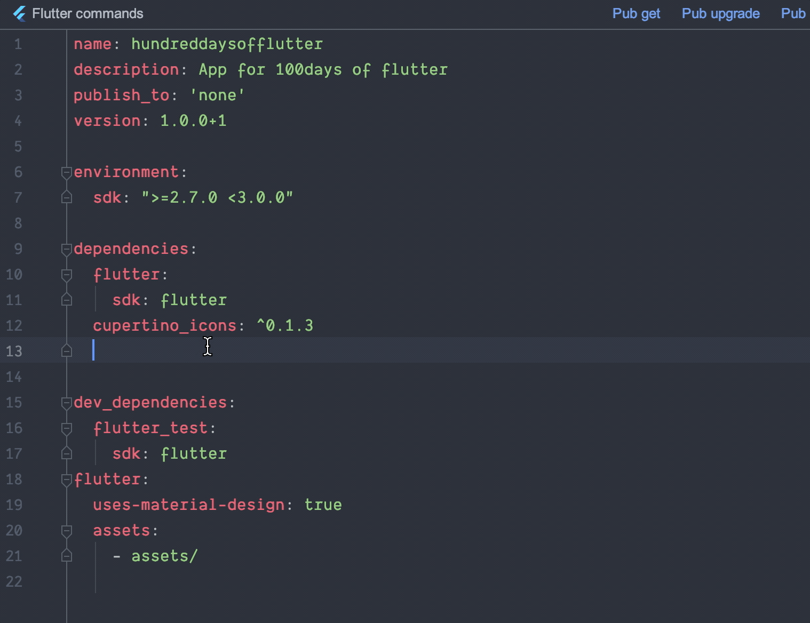
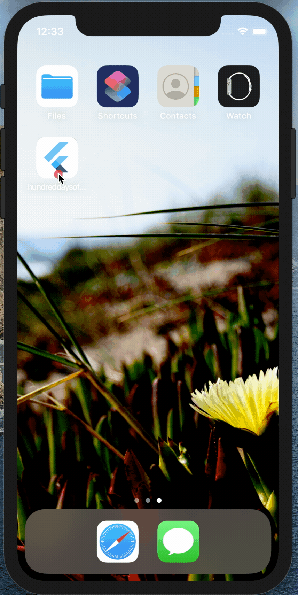
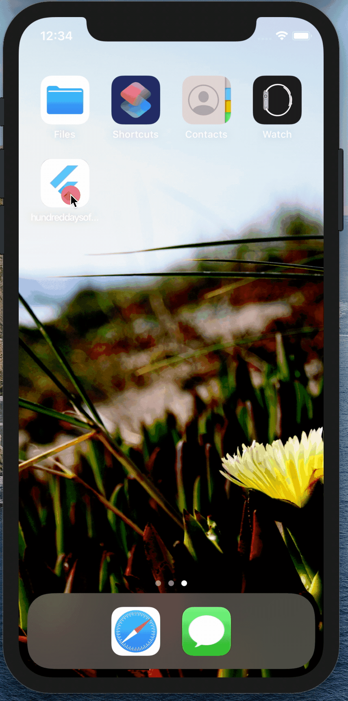

# Tips 57 - 63

## #Day57 typedef

`typedef` is used when you want to give an alias to a **`Function signature`**. As it can be laborous and error prone to type the Function Signature in every field or return type. As a bonus, we do not lose Function's type info.

__`Steps to use typedef:`__

Step 1 : Define a `typedef`  with Function Signature __`outside a class`__.

        typedef UserSelector = User Function(String, String);

Step 2 : Replace the Function Signature with typedef to declare members or return type.

    class A{
        //Use this ✅
        UserSelector userSelector;

        // Not this ❌
        User Function(String, String) userSelector;

        A ({this.userSelector});
    }

Step: Simply pass function/ lambda like you did before.

    //Pass lambda 
    var a = A(userSelector: (id, authKey) {
      return User(id, "User name");
    });

    //Pass Method
    var a = A(userSelector: getUser)

    User getUser(String id, String key) {
        return User(id, "User name");
    }

## #Day58 Easy Flutter installation

Still confused installing flutter in mac/linux easily?

1. Download Flutter zip.
2. Decompress it in desired directory.
3. `cd` to that desired directory from terminal.
      [🚨⚠️ flutter should be inside desired directory]
4. Run the following command  

        If you are using zsh:
        echo "\nexport PATH="\$PATH:`pwd`/flutter/bin"">>~/.zshrc ; source ~/.zshrc

        If you are using bash:
        echo "\nexport PATH="\$PATH:`pwd`/flutter/bin"">>~/.bashrc ; source ~/.bashrc

## #Day59 #BlackLifeMatter

Black lives matter ✊🏿& Racial Equality should be the norm.

This is a tip not just for Flutter developers but to all humans.

This is my tip number #59.

## #Day60 Using SVG

Even though flutter doesn't support any vector graphics out of the box, the package `flutter_svg` can render `svg` into Flutter app.

1. Add dependency :
        `flutter_svg: ^version`

2. Start using it like Flutter `Image` Widget.

        //load SVG from network
        SvgPicture.network("https://image.flaticon.com/icons/svg/124/124555.svg", height: 200)
        
        //load SVG from assets folder
        SvgPicture.asset("assets/ufo.svg", height: 200)

[visit flutter_svg](https://pub.dev/packages/flutter_svg#-readme-tab-)

## #Day61 Using Flare Animations

Similar to vector graphics, Flutter doesn't support vector animation natively. [Rive (rive.app)](https://rive.app/explore) helps with amazing vector animations in Flutter.

1. Add flare in `pubspec.yaml`:

        flare_flutter: ^version

2. Download flare files from [rive.app](https://rive.app/explore) & put those `.flr` files into `assets/` folder:

        assets:
            - assets/

3. Start using `FlareActor` widget.

        FlareActor(
            "assets/world.flr",

            //🚨Caution🚨, you can find 👉 #animation name in
            //left bottom 👈👇 of rive.app designer tool when
            //Animation tab is selected
            
            animation: "world")

[Visit Flare and SVG sample](https://github.com/erluxman/FlutterSVGFlareDemo)

## #Day62 pubspec autocomplete

When we want to add a dependency only way is either going to github document or pub.dev.

We can directly add dependencies from our IDEs using extensions/plugins.

__`For VS code`__ : [Pubspec Assist](https://marketplace.visualstudio.com/items?itemName=jeroen-meijer.pubspec-assist)            |  __`For Android Studio`__ : [Flutter Enhancement Suite](https://plugins.jetbrains.com/plugin/12693-flutter-enhancement-suite)
:-------------------------:|:-------------------------:
  |  

P.S. Flutter Enhancement Suite comes with a lot of other great features.

## #Day63 cached_network_image

`cached_network_image` helps to __`show`__ and __`cache`__ image from Internet.

It shows image from cache if it's already cached instead of downloading.

It will make app feel faster and save network bandwidth.

1. Add cached_network_image in pubspec.yaml

        dependencies:
        cached_network_image: ^version

2. Start using `CachedNetworkImage`.

        CachedNetworkImage(
                imageUrl: imageUrl,
                placeholder: (context, url) => CircularProgressIndicator(),
                errorWidget: (context, url, error) => Icon(Icons.error),
        )

[get cached_network_image](https://pub.dev/packages/cached_network_image#-readme-tab-)

Image.network            |  CachedNetworkImage
:-------------------------:|:-------------------------:
  |  

[___`Tips 1-7`___](README.md)
[__`Tips 08-14`__](week02.md)
[__`Tips 15-21`__](week03.md)
[__`Tips 22-28`__](week04.md)
[__`Tips 29-35`__](week05.md)
[__`Tips 36-42`__](week06.md)
[__`Tips 43-49`__](week07.md)
[__`Tips 50-56`__](week08.md)

[__`<< Previous`__](week08.md)
[___`Tips 57-63`___](week09.md)
[__`Next >>`__](week10.md)
